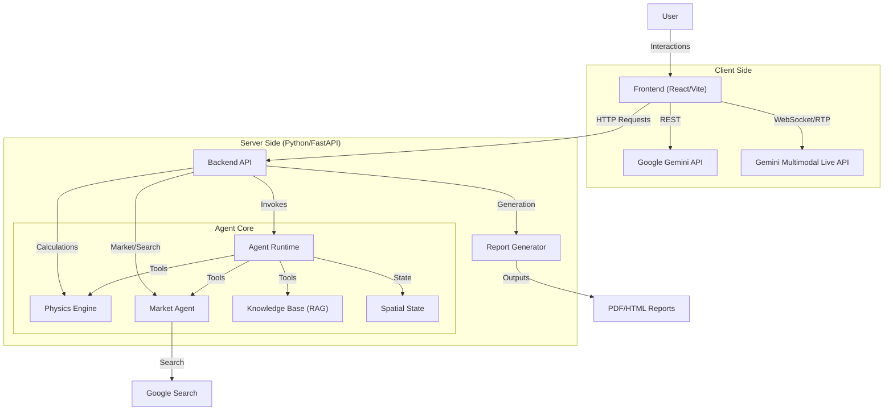

# Architecture Documentation

## 1. Overview

**Spatial Engine AI** is a multimodal agentic system designed to act as a Senior Optical Physicist. It combines a **deterministic physics engine** with **Generative AI** (Gemini 3.0) to audit spaces, calculate lighting requirements, and provide economic analysis for energy optimization.

The system is built on a modern hybrid architecture:
- **Frontend**: A reactive UI built with React and Vite.
- **Backend**: A high-performance Python API using FastAPI.
- **Agent Core**: Powered by Google GenAI SDK and the Agent Development Kit (ADK).

---

## 2. System Architecture

---

## 3. Core Components

### 3.1 Frontend (User Interface)
**Stack**: React 19, Vite, Tailwind CSS, TypeScript.

The frontend serves as the interactive dashboard for the user. It handles:
- **Image Uploads**: Sending room photos for vision analysis.
- **Real-time Chat**: Communicating with the Agent.
- **Visualizations**: Rendering light distribution heatmaps and ROI charts.
- **State Management**: displaying real-time updates from the "Vision Audit" and "Economic Engine".

Key Configuration:
- `vite.config.ts`: Configures the build and proxy settings.
- `tailwind.config.js`: definitions for the "Cyberpunk/Clean" aesthetic.

### 3.2 Backend (API & Orchestration)
**Stack**: Python 3.12+, FastAPI, Uvicorn.

The backend acts as the central hub, exposing REST endpoints for the frontend and encapsulating the complex logic of the agent.

**Key Modules:**
- **`main.py`**: The entry point. Defines API routes (`/api/lux-calculation`, `/api/spatial-audit`, etc.) and serves static frontend assets.
- **`report_generator.py`**: Logic for compiling analysis data into HTML engineering reports.
- **`pdf_generator.py`**: Converts HTML reports into downloadable PDF documents.

### 3.3 The Agentic Core
**Stack**: Google GenAI SDK, Google ADK.

Located in `my_agent/`, this is the "Brain" of the application.

- **`agent.py`**: Configures the `root_agent` with the "Senior Optical Physicist" persona and registers tools.
- **`spatial_state.py`**: Implements a short-term memory class (`SpatialState`) to persist room geometry and lighting configurations across conversation turns.
- **`physics_engine.py`**: Contains **deterministic** functions for Lux calculations ($E=I/d^2$), ROI analysis, and compliance checks (ISO/SanPiN). It ensures the AI doesn't "hallucinate" math.
- **`market_agent.py`**: Handles real-time data fetching (product prices, electricity rates) to ground the agent's economic advice in reality.

### 3.4 Data & Knowledge
- **`data/smart_home_standards.md`**: A static Markdown file acting as a Knowledge Base (RAG) for smart home standards (Zigbee, Matter, Hue). The agent consults this to ensure hardware compatibility.

### 3.5 Real-time Interaction (Gemini Live)
**Stack**: Google GenAI SDK (`@google/genai`), Web Audio API.

The **Gemini Live** feature enables low-latency, multimodal voice interaction directly from the browser.
- **Connection**: Establishes a WebSocket connection via `ai.live.connect`.
- **Audio Processing**:
    - **Input**: Captures microphone stream, downsamples to 16kHz PCM, and streams to the model.
    - **Output**: Receives raw audio chunks from the model and queues them for playback using the Web Audio API.
- **State**: Managed locally in `LiveAudioSession.tsx` (Connection status, Transcriptions, Audio Contexts).

---

## 4. Key Data Flows

### 4.1 Vision Audit
1.  User uploads an image via Frontend.
2.  Image is sent to Backend (`/api/spatial-audit`).
3.  Backend (mocking Gemini Vision for now) analyzes the image for:
    *   **Geometry**: Estimating floor area via reference objects.
    *   **Material**: Identifying wall textures for reflection coefficients.
4.  Data is returned to Frontend to update `SpatialState` visualization.

### 4.2 Physics & ROI Calculation
1.  User requests a calculation (e.g., "ROI of switching to LED").
2.  Agent parses parameters (Watts, Hours, Cost).
3.  Agent calls `calculate_roi_and_savings` (Physics Engine).
4.  Results are returned as structured JSON and visualized as Charts in the UI.

### 4.3 Report Generation
1.  User clicks "Export Report".
2.  Frontend sends current state data to `/api/export-pdf`.
3.  Backend compiles all session data (Audits, Calculations, Charts) into an HTML template.
4.  HTML is converted to PDF and streamed back to the browser.

---

## 5. Infrastructure

- **Package Manager**: `uv` is used for fast, reliable Python dependency management.
- **Containerization**: A `Dockerfile` is provided for containerizing the FastAPI application.
- **CI/CD**: `cloudbuild.yaml` suggests Google Cloud Build integration for deployment.
