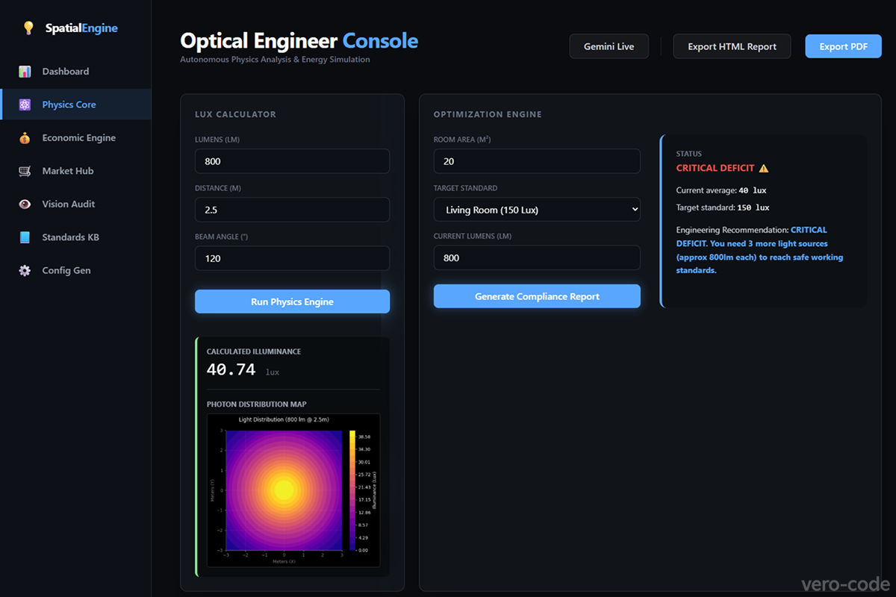
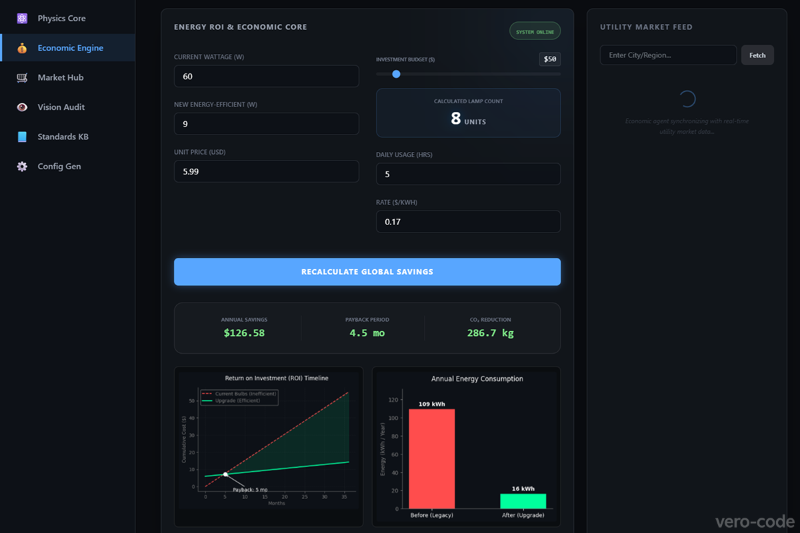
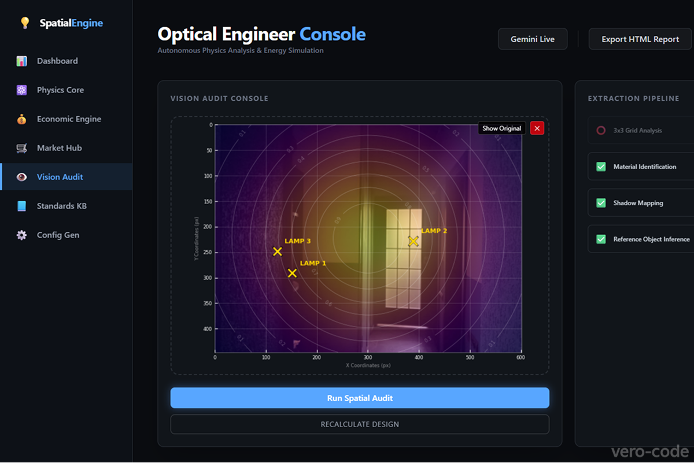
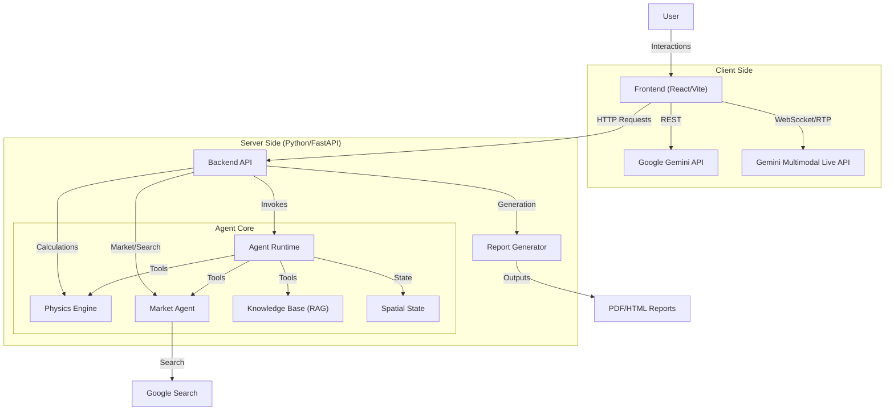

# Spatial Engine AI 💡 v0.4.0

> **DeepTech Autonomous Agent for Optical Physics & Energy Optimization**
> *Powered by Gemini 3 Pro & Google GenAI SDK*

Spatial Engine is a multimodal AI agent designed to act as a **Senior Optical Physicist**. Unlike standard chatbots, it combines Generative AI's vision capabilities with a deterministic physics engine to audit rooms, calculate lighting deficits, and project energy ROI.

---

## 🚀 Key Features

### 1. The Physics Core (Deterministic)
The agent does not "guess" math. It delegates calculations to a rigorous Python engine.
* **Illuminance Calculation**: Uses the Inverse Square Law ($E=I/d^2$) and Beam Angle geometry to calculate exact Lux levels at specific points.
* **Health Compliance (ISO/SanPiN)**: Automatically checks if lighting levels meet health standards for offices (500 Lux), living rooms, etc., and warns of safety deficits.
* **Unit Tested**: All physics formulas are covered by `unittest` to ensure 100% reliability.



### 2. The Market & Economic Engine (Real-Time)
The agent connects physics to the real economy.
* **Live Market Search**: Finds real-world products (prices, specs) and local electricity rates (USD/kWh) via Google Search.
* **ROI & Energy Calculator**: Computes financial savings (USD) and **CO2 reduction** when switching lighting technologies (e.g., Incandescent to LED).
* **Search Verification**: "Trust but Verify" logic. The agent reads product specs to ensure a lamp is truly "dimmable" or "smart" before recommending it.
* **Fallback Resilience**: Continues working offline using averaged market data if the internet connection fails.



### 3. The Vision System (Multimodal)
The agent can "see" and audit a room from a single photograph using **Gemini 3.0 Vision**.
* **3x3 Grid Analysis**: Mentally divides the image into sectors to pinpoint features (e.g., "Window in Sector 3").
* **Material Detection**: Analyzes wall textures (Concrete vs. Paint) to estimate Albedo (reflection coefficients).
* **Shadow Detection**: Identifies under-lit zones requiring optimization.
* **Scale Estimation**: Uses **Reference Object Inference** (e.g., comparing room width to standard door frames) to estimate floor area without user input.



### 4. Spatial State Memory (Stateful)
The agent possesses a "Short-term Memory" via the `SpatialState` class.
* **Persistence**: It remembers room geometry and light sources across multiple reasoning steps.
* **Layering**: Can combine visual data (from a photo) with technical data (from a PDF) into a single simulation model.

### 5. Technical Document Parsing
* **PDF Analysis**: Capable of reading datasheets and blueprints to extract technical specifications (Lumens, Watts, CRI).
* **Simulation**: Can "virtually install" a lamp found in a catalog into the scanned room to predict the final Lux level.

### 6. Standards & Compatibility (Expert System)
The agent acts as a certified engineer, not just a salesperson.
* **Knowledge Base (RAG)**: Consults internal standards (Zigbee, Matter, Philips Hue) to ensure hardware compatibility.
* **Config Generator**: Automatically generates JSON configuration files for Home Assistant/HomeKit based on the designed lighting scenes.

### 7. Agentic Workflow
* **Tool Use**: Autonomous Function Calling (The agent decides when to calculate, when to search, and when to read standards).
* **Streaming CLI**: Real-time "Thinking" logs showing Tool Calls and arguments in the terminal.

---

## 🏗️ Architecture

> For detailed documentation on system design and data flows, see [ARCHITECTURE.md](ARCHITECTURE.md).



## 🛠️ Project Structure

```
spatial-engine/
├── backend/                # FastAPI Backend
│   ├── main.py             # API Entry Points
│   ├── report_generator.py # HTML Report Logic
│   └── pdf_generator.py    # PDF Export Logic
├── frontend/               # React Frontend (Vite)
│   ├── src/
│   │   ├── components/     # UI Components (VisionAudit, EconomicEngine, etc.)
│   │   └── App.tsx         # Main UI Layout
├── my_agent/               # The AI Core
│   ├── agent.py            # The "Brain"
│   ├── market_agent.py     # The "Hands"
│   ├── physics_engine.py   # The "Core"
│   └── spatial_state.py    # The "Memory"
├── data/
│   └── smart_home_standards.md # RAG Knowledge Base
├── tests/                  # Unit Tests
├── .env                    # Configuration
├── pyproject.toml          # Python Dependencies
└── README.md               # Documentation
```

## ⚡ Quick Start

### Prerequisites

-   Python 3.12+
    
-   `uv` (modern Python package manager)
    
-   Google Gemini API Key
    

### Installation

1.  **Clone & Sync:**
    
    ```
    git clone https://github.com/vero-code/spatial-engine.git
    cd spatial-engine
    uv sync
    ```
    
2.  **Configure Environment:**
    
    Create a .env file:
    
    ```
    # for backend
    GOOGLE_API_KEY=your_gemini_key_here
    
    # for frontend
    VITE_GEMINI_API_KEY=your_gemini_key_here
    ```
    
3.  **Run the Agent:**
    
    ```
    # Start the Backend
    uv run uvicorn backend.main:app --reload

    # Start the Frontend (in a new terminal)
    npm run dev --prefix frontend
    ```
    
4.  **Run Tests:**
    
    ```
    # Verify physics engine integrity
    uv run python -m unittest discover tests
    ```
----------

## 🗺️ Roadmap Status

### 🚩 Sprint 1: The Core (Completed)
> *Status: Fully Operational. 100% Test Coverage.*
- [x] **Infrastructure**: Environment setup (`uv`), Project structure, Basic ADK integration.
- [x] **Physics Engine**: Deterministic calculations for Illuminance ($E = I/d^2$) and Energy ROI.
- [x] **Reliability**: Pydantic typing for tools, `unittest` suite coverage, Chain of Thought logging.
- [x] **Persona**: Senior Optical Engineer system prompt configuration.

### 👁️ Sprint 2: The Vision (Completed)
> *Status: Implemented. Agent "sees" geometry and materials, "reads", and "remembers".*
- [x] **Multimodality**: Binary File Handler for image uploads.
- [x] **Visual Analysis**: 3x3 Grid decomposition, Shadow Detection, Material/Albedo identification.
- [x] **Spatial Reasoning**: Scale estimation via Reference Object Inference (no user input needed).
- [x] **Advanced Features**: PDF Parser for blueprints, Persistent Spatial State class.

### 🛒 Sprint 3: The Market & Intelligence (Completed)
> *Status: Implemented. Connecting Physics to Economics, Standards & Safety.*
- [x] **Market Agent**: Multi-threaded Google Search for products and electricity rates.
- [x] **Search Verification**: Agent verifies technical specs (e.g., `is_dimmable`, `protocol`) before recommending to ensure compatibility.
- [x] **Health Checks**: ISO/SanPiN compliance tool (Pass/Fail verdicts for Lux levels).
- [x] **Smart Standards (RAG)**: Knowledge Base for Zigbee/Matter/Hue compatibility.
- [x] **Config Generator**: JSON output for Home Assistant scenes (Focus/Relax/Movie).
- [x] **Robustness**: Fallback Mode logic for offline operation.

### 🎨 Sprint 4: The Interface (Completed)
> *Status: Fully Operational. Generative UI and Reporting live.*
- [x] **Visualization**: Heatmaps for Vision Audit and Physics Engine.
- [x] **Reporting**: HTML and PDF report generation.
- [x] **Generative UI**: Interactive React Frontend with Budget Slider and real-time updates.

### 🏆 Sprint 5: The Pitch (Planned)
> *Goal: Polish and Submission.*
- [ ] **Optimization**: Latency reduction, Error handling, End-to-End testing.
- [ ] **Documentation**: Architecture diagrams, Demo video script, Final submission text.
   
----------

_Built for the Gemini 3 Hackathon._